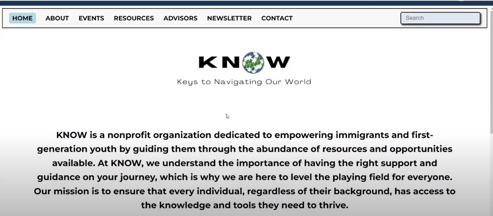

# Web Application for KNOW website
## Overview
KNOW is a web application developed to support first-generation immigrants by providing easy access to essential resources and expert advisors. This platform, built with Vue.js, offers a responsive interface where users can find information, connect with the community, and manage events through an integrated calendar. KNOW is designed to be a vital tool for immigrants adjusting to new environments.

## Project Setup

### Install Vue.js
- First, ensure that Vue.js is installed by running the following command in the project directory:
        ```npm install```

### Install Vue Router
- For routing between different pages in the project, install Vue Router:
        ```npm install vue-router```

### Install vue-cal
- To display the calendar and manage events, you'll need to install the vue-cal package:
        ```npm install vue-cal```

### Run the Project
- To start the development server and hot-reload the application, use the following command:
        ```npm run serve```
  
## Demo 
To watch the video demonstration of the running application: 
[](https://www.youtube.com/watch?v=y6NH_3Hnb8A)
